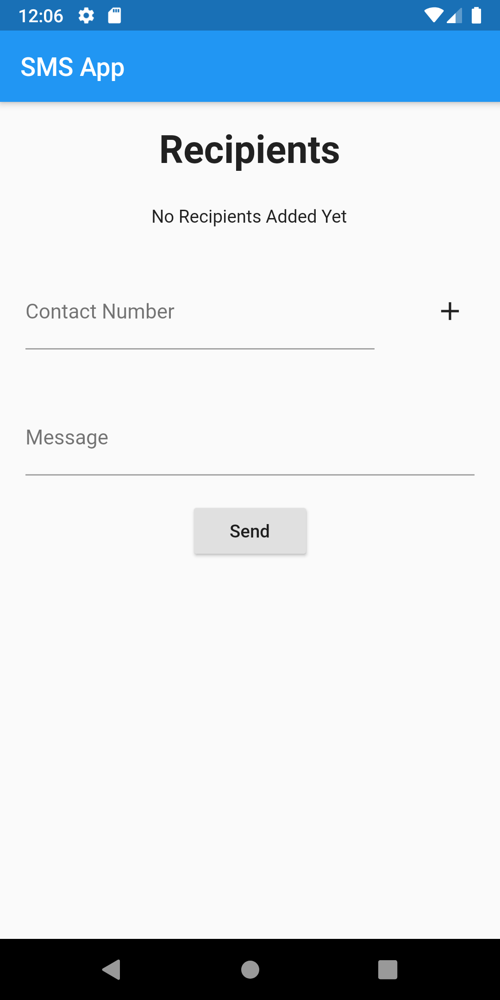
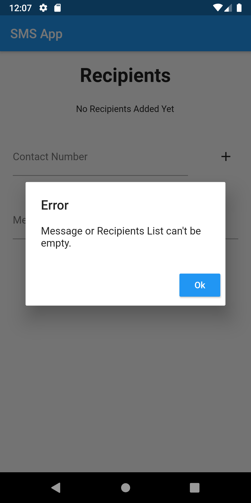
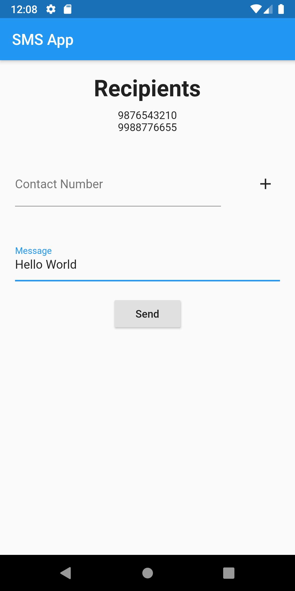
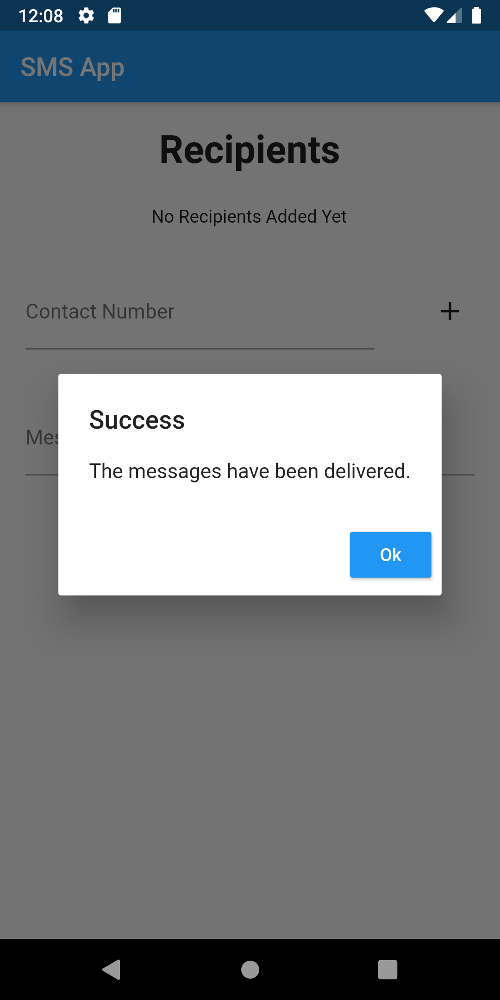

# sms_app

This is an app to send bulk messages to multiple contacts at same time.  
This app is built on flutter using <strong>sms</strong> package but it can only be used on an android device as the package used to send message is not supported by iOS.

### Screenshots

 

